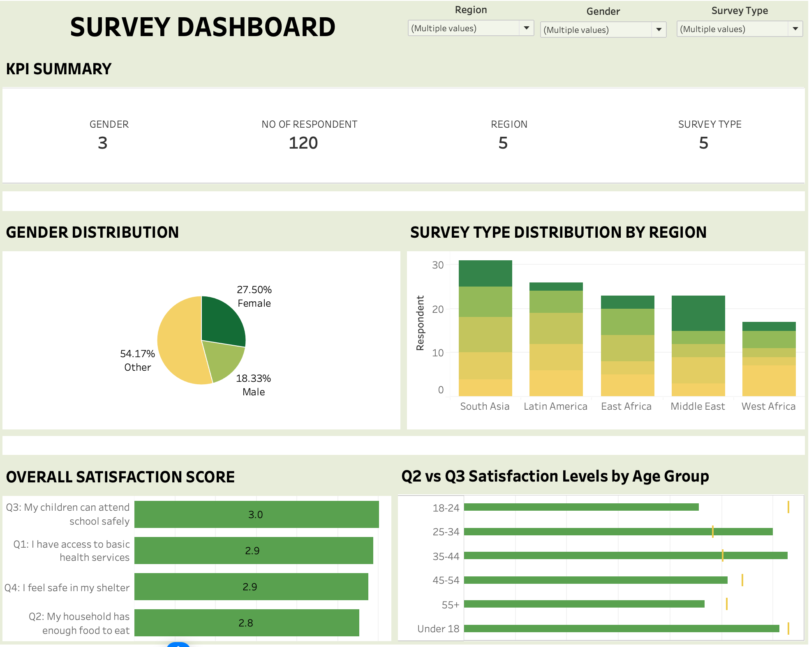

<div align="center">
  <h1><b>TALENT-LAB-ASSESSMENT (Global Humanitarian Needs Survey Analysis) </b></h1>
</div>


## Overview 

This project analyzes humanitarian survey data collected across multiple global regions to understand quality of life and access to essential services. The dataset consists of respondent-level survey feedback, capturing demographics, region, and satisfaction ratings related to critical living conditions.


## Data Sources 📊
- The dataset was provided in Amdari.io in a xlsx format for transparency and reproductibility.

### Data Dictionary
Column	Description
Submission Date -	When the survey response was submitted
Region - Geographic region of the respondent (e.g., West Africa, South Asia)
Survey Type - Focus area of the survey (Health, Education, Shelter, etc.)
Respondent ID - Unique identifier for each participant
Gender - Male, Female, or Other
Age Group - Grouped age ranges (e.g., 18–24, 25–34, etc.)
Q1 - Access to basic health services
Q2 - Household food security
Q3 - Children’s ability to attend school safely
Q4 - Sense of safety in shelter
Q5 - Access to clean water

## Topical Questions
#### Questions 🤔:

ANALYTICAL QUESTIONS
The following analytical questions will help us gain insight 

- Which region has the best access to health services? Calculated average Q1 score by region.

- Which age group is struggling the most with health services? Identified lowest-rated age group for Q1.

- How many people feel food secure across regions? Determined % of respondents selecting “Strongly Agree” (rating 5) for Q2.

- Which survey focus area shows the highest overall satisfaction? Computed average scores across Q1–Q4 by Survey Type.

- Do male and female respondents differ in school-related safety satisfaction? Compared Q3 averages by gender.

- Are health access and food security related? Measured correlation between Q1 and Q2.

### Scenario / What-If Analysis 🔬:

1. If Q1 scores increase by 1 point for respondents under 25, how does the overall average
change?
2. Build a two-variable data table showing how Q2 and Q3 averages change with different
regional weights.


## 🛠 Built With <a name="built-with"></a>

### Tech Stack <a name="tech-stack"></a>


<details>
<summary>Language</summary>
  <ul>
    <li><a href="https://www.python.org/">Python</a></li>
  </ul>
</details>


## Packages and Libraries 📚
#### Collection of significant Python Libraries:
- Pandas
- Numpy


## Cleaning the Data 🧹
#### We begin by thoroughly cleaning our data.
- Changing datetime format 
- Dealing with Duplicates
- Trimming spaces


## Analysis 🔍
- Utilizing Python and data analysis libraries such as Pandas and Numpy, we performed exploratory data analysis (EDA) to uncover trends and insights.
- We analyzed survey questions by Age group, Region, Survey Type.


## Key Files 📂
- `assessment.ipynb`: Jupyter Notebook containing the code for data cleaning, EDA.
- Raw data used for analysis.
>Output.xlsx, TL20251023Mock Survey.xlsx

- `README.md`: This file providing an overview of the project.


<p align="right">(<a href="#readme-top">back to top</a>)</p>
<!-- Features -->

## Key Insights <a name="key-features"></a>

- South Asia ranked highest (3.4), while East Africa (2.66) and Latin America (2.55) ranked lowest, showing uneven health service access across regions.

- The Middle East showed the strongest food security (19.2% rating “5”), while West Africa was the most food-insecure (5.9%).

- Health Access had the highest satisfaction (3.08), and Water & Sanitation scored lowest (2.76), indicating room for improvement in basic utilities.

- A correlation of 0.068 shows almost no relationship—better health access does not guarantee better food security.


<p align="right">(<a href="#readme-top">back to top</a>)</p>


<!-- DASHBOARD -->

## 💻 Dashboard 
<a name="Dashboard"></a>




<!-- GETTING STARTED -->

## 💻 Getting Started <a name="getting-started"></a>


To get a local copy up and running, follow these steps.

### Prerequisites

In order to run this project you need:

- Python


### Setup

Clone this repository to your desired folder:


```sh
  cd my-folder
  git clone https://github.com/bamzyyyy/TALENT-LAB-ASSESSMENT
```

Change into the cloned repository

```sh
  cd TALENT-LAB-ASSESSMENT
  
```

Create a virtual environment

```sh

python -m venv env

```

Activate the virtual environment

```sh
    env/Scripts/activate
```


### Install

Here, you need to recursively install the packages in the `requirements.txt` file using the command below 

```sh
   pip install -r requirements.txt
```


<!-- AUTHORS -->

## 👥 Authors <a name="authors"></a>

- 🕵🏽‍♀️ **Aminu Oluwarotimi Desmond**                  [GitHub Profile](https://github.com/bamzyyyy?tab=repositories)


<p align="right">(<a href="#readme-top">back to top</a>)</p>


<!-- CONTRIBUTING -->

## 🤝 Contributing <a name="contributing"></a>

Contributions, issues, and feature requests are welcome!

Feel free to check the [issues page](../../issues/).

<p align="right">(<a href="#readme-top">back to top</a>)</p>

<!-- SUPPORT -->

## ⭐️ Show your support <a name="support"></a>

If you like this project kindly show some love, give it a 🌟 **STAR** 🌟

<p align="right">(<a href="#readme-top">back to top</a>)</p>

<!-- ACKNOWLEDGEMENTS -->

## 🙏 Acknowledgments <a name="acknowledgements"></a>

We acknowledge the Amdari team for providing data for me to deliver this real-life project.

<!-- LICENSE -->

## 📝 License <a name="license"></a>

This project is [MIT](./LICENSE) licensed.
